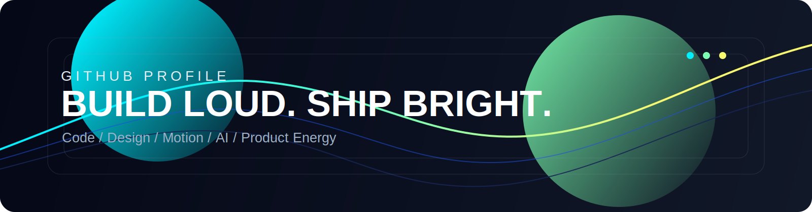

---

  

  

---

✨ I’m **Jiang**, a developer focused on building clean, responsive, and maintainable web experiences.

🎨 Most of my day-to-day work lives around frontend engineering, component-driven UI, and turning product ideas into interfaces that feel precise and smooth.

🛠️ I also enjoy extending that workflow into backend basics and engineering tooling so the whole development loop stays efficient.

---

### Languages:

### Frameworks and Tools:

### UI:

### Backend:

### Actively Exploring:

### GitHub Stats:

  
  

---

  
  
  
  

